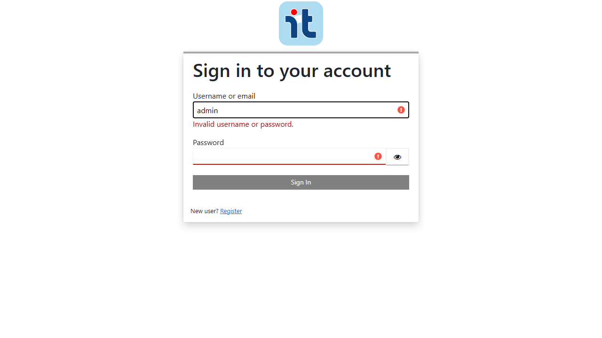
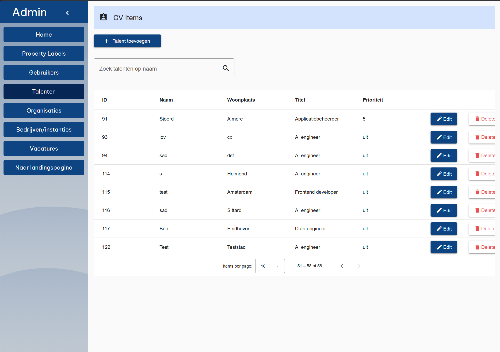
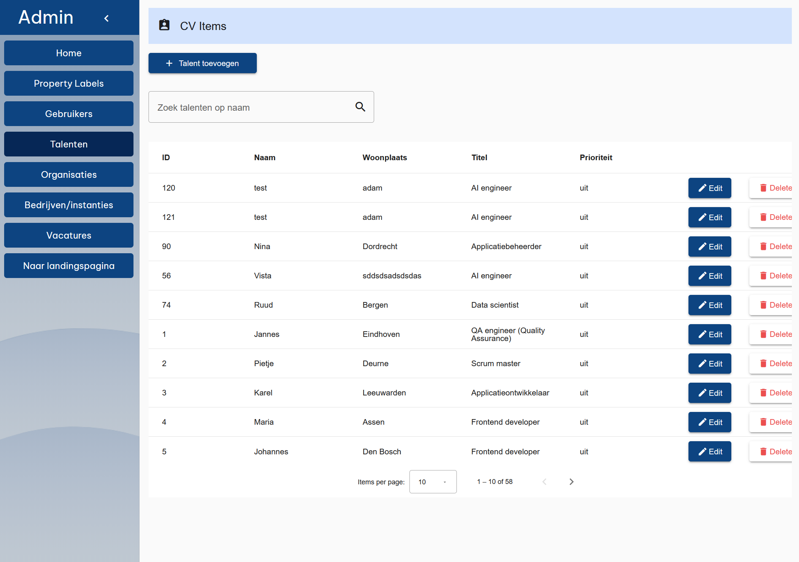
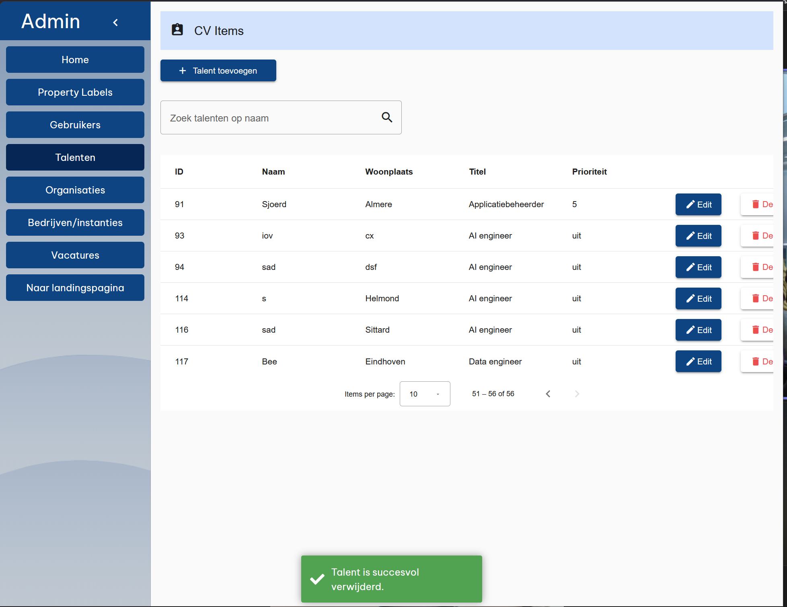
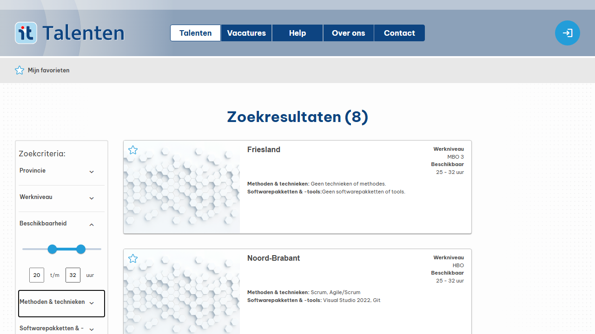

<!-- _class: title -->

# Testproces & Bevindingen
## IT Talenten Portaal

**Steven Kemp** - Software Developer
Vista College · MBO Software Tester · 2026

---

<!-- header: Introductie -->

# Introductie

**Wie:** Steven Kemp, software/RPA developer

**Project:** IT Talenten Portaal - een applicatie die potentiële werknemers koppelt met werkgevers, met focus op het IT-vakgebied

---

<!-- header: "Agenda" -->

# Agenda

- Voorbereiding
- Testproces
- Bevindingen
- Verbetervoorstellen
- Conclusie

---

<!-- header: Voorbereiding -->

# Voorbereiding

Drie stappen voordat ik kon beginnen met testen

1. Source Requirement Specification opstellen(SRS)
2. Scope bepalen
3. Testplan schrijven

---

<!-- header: Voorbereiding -->

# SRS

- Talenten Portaal team gebruikts geen SRS, zelf opgestellen dus!
- Aanpak: 
  - Op basis can SRS van IT showcase 
  - Claude Code 
  - Crawlen van Talentenportaal(met playwright)
  - Bewuste keuze: snel afgeronden, 't hoeft niet perfect!

---

<!-- header: Voorbereiding -->

# Scope

**Wel testen**
- Sessiemanagement
- Talentenprofiel
- Zoeken en filteren
- Organisatie en vacature aanmaken
- Afschermen NaW-gegevens

**Niet testen**
- Vacatures filteren
- Externe koppelingen (sociale media, UWV)
- White-label thema's
- Geolocatie

**Keuze gebaseerd op:** kernfunctionaliteit, AVG-compliance, businessperspectief

---

<!-- header: Voorbereiding -->

# Testplan

**24 testcases** verdeeld over:
- Sessiemanagement en autorisatie (TC-001 t/m TC-007)
- Zoeken en filteren (TC-008, TC-009)
- Talentprofiel zichtbaarheid (TC-010, TC-011)
- IDOR-test (TC-012)
- Admin talentenbeheer (TC-013 t/m TC-024)

**Aanpak:** Playwright geautomatiseerd op Chrome, aanvullend handmatig op Chrome, Edge en Safari

**Testvolgorde:** bezoeker, ingelogde gebruiker, admin

---

<!-- header: Voorbereiding -->

# Uiteindelijk
- Niet  trots op de SRS, een goede  maken kost tijd
- Scope bleek te groot, dit merkte ik tijdens het schrijven van testplan en uitvoer daarvan.

---

<!-- _class: title -->

# Testproces
## Het plan was solide. De uitvoering: minder.

---

<!-- header: Testproces -->

# Aanpak

- Playwright-tests geschreven met Claude Code
- Plan: snel geautomatiseerde tests genereren, bleek meer werk dan verwacht
---

<!-- header: Testproces -->

# Wat ik tegenkwam

- TC-008: gegenereerd script testte niet wat het beloofde — filter leek te werken maar valideerde de verkeerde waarde
- TC-006: geautomatiseerde test faalde, handmatige inspectie toonde dat de applicatie wél correct werkte (te brede CSS-selector)
- TC-003: onverwachte bevinding buiten het testplan, loginpagina volledig in het Engels terwijl de applicatie op een Nederlands publiek gericht is

---

<!-- header: Testproces -->

# Mismatch in planning

| | Gepland | Werkelijk |
|---|---|---|
| Fase 1: bezoeker | 16 maart | 27 maart |
| Fase 2: ingelogde gebruiker | 18 maart | 7 april |
| Fase 3: admin | 20 maart | 14 april |

Bijna vier weken vertraging. De automatisering kostte veel meer tijd dan verwacht, en een deel van de tests is uiteindelijk niet afgemaakt.

---

<!-- header: Testproces -->

# Wat me opviel

- Scope was te breed, dit merkte ik pas tijdens het testplan en het testen zelf. 
- Deel van de geplande tests niet afgemaakt. 
- Poging om AI de resterende tests te laten uitvoeren om gaten te vullen, mislukt
- weet niet of AI-gegenereerde testsmoet je altijd valideren, maar handmatig scannen kost net zoveel tijd als handmatig testen dus waarom?
- Testen is een vak apart, ik verveel me er snel bij

---

<!-- _class: title -->

# Bevindingen
## Spoiler: de app leeft nog.

---

<!-- header: Bevindingen -->

# Overzicht

| Status | Aantal |
|--------|--------|
| Geslaagd | 19 |
| Gefaald | 0 |
| Geblokkeerd | 0 |
| Overgeslagen | 5 |

Alle voorbedachte testcases zijn geslaagd — maar dat is geen reden tot jubelen.

We hebben zeker dingen gevonden. Alle bevindingen lagen echter in de periferie: taalgebruik, ontbrekende feedback, een layoutprobleem.

---

<!-- header: Bevindingen -->

# Toelichting

Bevindingen en verbetervoorstellen zijn per slide gecombineerd om de presentatie compact te houden.

| ID | Bevinding |
|----|-----------|
| F-001 | Loginpagina in het Engels |
| F-002 | Geen uitlogknop in admin panel |
| F-003 | Geen bevestigingsmelding na formulieracties |
| F-004 | Delete-knop afgesneden bij middelgrote viewports |

**Begrippen**

**Story points:** relatieve maat voor complexiteit

**Must have:** vereist · **Should have:** belangrijk, niet kritiek · **Could have:** wenselijk

---

<!-- header: Bevindingen -->

# F-001

De loginpagina toont alle tekst in het Engels, terwijl de applicatie gericht is op een Nederlands publiek.

**VP-001 · Should have · 3 story points**
Loginpagina vertalen naar Nederlands
*Raakt alle gebruikers; staat onprofessioneel voor een Nederlandstalige applicatie*

---

<!-- header: Bevindingen -->

# F-002

In het admin panel ontbreekt een uitlogknop. Een beheerder kan de sessie niet afsluiten vanuit de beheerpagina.

**VP-002 · Could have · 2 story points**
Uitlogknop toevoegen aan admin panel
*Workaround beschikbaar; kleine interne doelgroep*

---

<!-- header: Bevindingen -->

# F-003

Na een verwijderactie volgt direct een redirect zonder confirmatiedialog vooraf. Acties zijn daardoor niet terug te draaien.

**VP-003 · Should have · 2 story points**
Bevestigingsmelding na formulieracties
*Laag implementatie-inspanning; verhoogt gebruikersvertrouwen*

---

<!-- header: Bevindingen -->

# F-004

Bij een middelgrote viewport worden de delete-knoppen in de beheertabel afgesneden aan de rechterkant.

**VP-004 · Could have · 5 story points**
Layout admin tabel herzien
*Visueel gebroken maar functioneel intact; raakt alleen interne gebruikers*

---

<!-- _class: title -->

# Verbetervoorstellen
## Geen must haves. Eén grote droom.

---

<!-- header: Verbetervoorstellen -->

# VP-005 — Gecombineerde reisafstand-filter

Werklocatie en reisafstand zijn nu losse filters, maar alleen samen zinvol. Een organisatie zoekt niet op provincie — ze zoeken op bereikbaarheid vanuit hun eigen vestiging.

**Voorstel:** één filter waarbij de gebruiker een locatie en maximale reisafstand invoert.

*Proactief voorstel · Could have · 21 story points*

---

<!-- header: Verbetervoorstellen -->

# Planning

| Sprint | Periode | Voorstellen | Story points |
|---|---|---|---|
| Sprint 1 | Juni, eerste helft | VP-001, VP-003, VP-004 | 10 |
| Sprint 2 | Juni, tweede helft | VP-002 | 2 |
| — | Juli | Vakantie | — |
| Sprint 3 | Augustus | VP-005 | 21 |

---

<!-- _class: title -->

# Conclusie
## Wat ik heb geleerd over testen, en of ik dat leuk vond.

---

<!-- header: Conclusie -->

De applicatie bevat weinig problemen met hoge impact. Een teken dat veel testers hun ogen op deze applicatie hebben gehad.

Wel zijn er verbeterpunten, met name in de gebruikerservaring van het admin panel.

Geen must haves. De applicatie is klaar voor gebruik.

---

<!-- header: Conclusie -->

# Wat ik heb geleerd

- Meer tijd aan scope bepalen is de moeite waard
- Fouten vind je niet per se waar je ze verwacht
- Voorbereiding (SRS, scopen, plannen) vind ik leuk, uitvoeren niet
- AI-tools kunnen nog niet zelfstandig testen, maar zijn wel bruikbaar voor randzaken

---

<!-- _class: title -->

# Vragen?

Kijk op [stinkysteven2.github.io/vista-portfolio](https://stinkysteven2.github.com/vista-portfolio/)
of stuur ze naar
[steven.kemp@bee-organisation.com](mailto:steven.kemp@bee-organisation.com)
