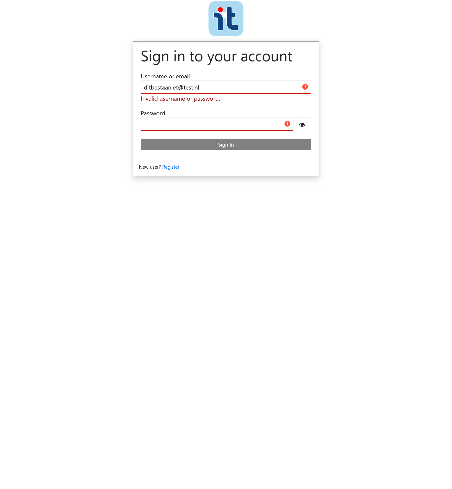

# Testrapport — IT Talenten Portaal

> Auteur: Steven
> Datum: maart 2026
> Applicatie: [IT Talenten Portaal](https://it-talenten-portaal-test-it-talenten-webapp-test.iapmkw.easypanel.host/talent)
> Gebaseerd op: testplan en testcases uit deelopdracht 6

---

## 1. Inleiding

Dit testrapport beschrijft de resultaten van de uitgevoerde testen op het IT Talenten Portaal. De testen zijn gebaseerd op het testplan uit deelopdracht 6 en zijn uitgevoerd via geautomatiseerde Playwright-scripts.

---

## 2. Testomgeving

**Geautomatiseerd**

| Onderdeel | Details |
|---|---|
| Applicatie | IT Talenten Portaal |
| URL | https://it-talenten-portaal-test-it-talenten-webapp-test.iapmkw.easypanel.host/talent |
| Browser | Chromium (headless) via Playwright |
| Authenticatie | Keycloak (bee-ids-test.azurewebsites.net) |
| Testscript | `lib/run_tests.py` |

**Handmatig**

| Onderdeel | Details |
|---|---|
| Besturingssysteem | Windows 10 |
| Browser | Firefox |

---

## 3. Testresultaten

<!-- GENERATED:OVERZICHT:START -->
| TC-ID | Omschrijving | Eis | Prioriteit | Status | Uitgevoerd om |
|---|---|---|---|---|---|
| [TC-001](#tc-001--detail) | Inloggen met geldige gegevens | FE1 | Hoog | **GESLAAGD** | 2026-04-03 12:24:19 |
| [TC-002](#tc-002--detail) | Inloggen met onjuist wachtwoord | FE1 | Hoog | **GESLAAGD** | 2026-04-03 12:24:25 |
| [TC-003](#tc-003--detail) | Inloggen met onbekend e-mailadres | FE1 | Gemiddeld | **GESLAAGD** | 2026-03-27 11:55:48 |
| [TC-004](#tc-004--detail) | Uitloggen | FE2 | Hoog | **GESLAAGD** | 2026-04-03 12:24:31 |
<!-- GENERATED:OVERZICHT:END -->

<!-- GENERATED:DETAILS:START -->
### TC-001 — Detail

**Teststappen:**
1. Navigeer naar de startpagina (`/talent`)
2. Klik op het login-icoon (`section#login i.material-icons`) in de navigatiebalk
3. Keycloak-loginpagina laadt op extern domein
4. Vul geldige gebruikersnaam en wachtwoord in
5. Klik op "Sign In"

**Verwacht resultaat:** Doorgestuurd naar startpagina; logout-knop zichtbaar; login-knop verdwenen

**Werkelijk resultaat:**
- URL: https://it-talenten-portaal-test-it-talenten-webapp-test.iapmkw.easypanel.host/talent
- Logout zichtbaar: True
- Login zichtbaar: False

**Conclusie:** Inloggen werkt correct. De applicatie stuurt de gebruiker terug naar de startpagina en toont het logout-icoon.

**Bewijs:**

---

### TC-002 — Detail

**Teststappen:**
1. Navigeer naar de startpagina (`/talent`) — frisse sessie (niet ingelogd)
2. Klik op het login-icoon in de navigatiebalk
3. Keycloak-loginpagina laadt
4. Vul geldige gebruikersnaam in, maar een onjuist wachtwoord
5. Klik op "Sign In"

**Verwacht resultaat:** Blijft op loginpagina; foutmelding 'Invalid username or password.' zichtbaar

**Werkelijk resultaat:**
- URL: https://bee-ids-test.azurewebsites.net/realms/bee-ideas-testing-realm/login-actions/authenticate?execution=f43f0322-1769-446a-8e4d-a96c0f233db6&client_id=angular-app-client&tab_id=64rs34enGpM&client_data=eyJydSI6Imh0dHBzOi8vaXQtdGFsZW50ZW4tcG9ydGFhbC10ZXN0LWl0LXRhbGVudGVuLXdlYmFwcC10ZXN0LmlhcG1rdy5lYXN5cGFuZWwuaG9zdC90YWxlbnQiLCJydCI6ImNvZGUiLCJybSI6ImZyYWdtZW50Iiwic3QiOiJhNWRkNWNlYS00MGQ1LTQyYmEtOGZiMy1lYzcxZTA2YmVhNjEifQ
- Foutmelding: 'Invalid username or password.'

**Conclusie:** Het systeem toont de juiste foutmelding en stuurt de gebruiker niet door. Werkt correct.

**Bewijs:**

---

### TC-003 — Detail

**Teststappen:**
1. Navigeer naar de startpagina (`/talent`) — handmatig, Firefox
2. Klik op het login-icoon in de navigatiebalk
3. Keycloak-loginpagina laadt
4. Vul een onbekend e-mailadres in (`ditbestaaniet@test.nl`) en willekeurig wachtwoord
5. Klik op "Sign In"

**Verwacht resultaat:** Blijft op loginpagina; foutmelding 'Invalid username or password.' zichtbaar; identiek aan TC-002

**Werkelijk resultaat:**
- URL: Keycloak authenticate-endpoint (geen redirect naar portaal)
- Foutmelding: 'Invalid username or password.'

**Conclusie:** Het systeem maakt geen onderscheid tussen onbekend account en fout wachtwoord. Werkt correct.

**Bewijs:**

---

### TC-004 — Detail

**Teststappen:**
1. Log in met geldige gegevens (zie TC-001)
2. Klik op het logout-icoon in de navigatiebalk

**Verwacht resultaat:** Login-icoon zichtbaar; logout-icoon verdwenen

**Werkelijk resultaat:**
- Login zichtbaar: True
- Logout zichtbaar: False

**Conclusie:** Uitloggen werkt correct. De applicatie toont het login-icoon en verbergt het logout-icoon.

**Bewijs:**

<!-- GENERATED:DETAILS:END -->

---

## 4. Gevonden fouten

### F-001: Loginpagina in het Engels

| Veld | Details |
|---|---|
| Ernst | Middel |
| Gevonden bij | TC-001, TC-002, TC-003 |
| Rol | Alle gebruikers |

**Teststappen:** Klik op het login-icoon in de navigatiebalk.

**Verwacht:** Loginpagina in het Nederlands (applicatie is gericht op Nederlandse gebruikers).

**Werkelijk:** Loginpagina toont Engelse teksten ("Sign in to your account", "Username or email", "Password", "Sign In", "New user? Register").

**SRS-eis:** Niet expliciet vastgelegd, maar strijdig met de Nederlandse context van de applicatie.

---

## 5. Statistieken

<!-- GENERATED:STATISTIEKEN:START -->
| Maat | Waarde |
|---|---|
| Totaal aantal testen | 4 |
| Geslaagd | 4 |
| Gefaald | 0 |
| Geblokkeerd | 0 |
| Slaagpercentage | 100% |
<!-- GENERATED:STATISTIEKEN:END -->

> Let op: dit rapport bevat TC-001 t/m TC-003. De overige testcases worden in volgende sessies toegevoegd.

---

## 6. Conclusie

*Nog in te vullen nadat alle testcases zijn uitgevoerd.*
