# Testrapport — IT Talenten Portaal

> Auteur: Steven
> Datum: april 2026
> Applicatie: [IT Talenten Portaal](https://it-talenten-portaal-test-it-talenten-webapp-test.iapmkw.easypanel.host/talent)
> Gebaseerd op: testplan en testcases uit deelopdracht 6

---

## 1. Inleiding

Dit testrapport beschrijft de resultaten van de 19 uitgevoerde testen op het IT Talenten Portaal. De testen zijn gebaseerd op het testplan uit deelopdracht 6. Een deel van de testen is volledig geautomatiseerd uitgevoerd via Playwright; waar automatisering niet haalbaar was (complexe Angular Material-formulieren, visuele controles) is handmatig getest.

---

## 2. Testomgeving

**Geautomatiseerd**

| Onderdeel | Details |
|---|---|
| Applicatie | IT Talenten Portaal |
| URL | https://it-talenten-portaal-test-it-talenten-webapp-test.iapmkw.easypanel.host/talent |
| Browser | Chromium (headless) via Playwright |
| Authenticatie | Keycloak (bee-ids-test.azurewebsites.net) |
| Testscript | `lib/run_tests.py` |

**Handmatig**

| Onderdeel | Details |
|---|---|
| Besturingssysteem | Windows 10 |
| Browser | Firefox |

---

## 3. Testresultaten

<!-- GENERATED:OVERZICHT:START -->
| TC-ID | Omschrijving | Eis | Prioriteit | Status | Uitgevoerd om |
|---|---|---|---|---|---|
| [TC-001](#tc-001--inloggen-met-geldige-gegevens) | Inloggen met geldige gegevens | FE1 | Hoog | **GESLAAGD** | 2026-04-03 12:24:19 |
| [TC-002](#tc-002--inloggen-met-onjuist-wachtwoord) | Inloggen met onjuist wachtwoord | FE1 | Hoog | **GESLAAGD** | 2026-04-03 12:24:25 |
| [TC-003](#tc-003--inloggen-met-onbekend-e-mailadres) | Inloggen met onbekend e-mailadres | FE1 | Gemiddeld | **GESLAAGD** | 2026-03-27 11:55:48 |
| [TC-004](#tc-004--uitloggen) | Uitloggen | FE2 | Hoog | **GESLAAGD** | 2026-04-03 12:24:31 |
| [TC-005](#tc-005--sessie-beëindigd-na-uitloggen) | Sessie beëindigd na uitloggen | FE2 | Hoog | **GESLAAGD** | 2026-04-03 12:32:43 |
| [TC-006](#tc-006--talentprofiel-afgeschermd-voor-bezoekers) | Talentprofiel afgeschermd voor bezoekers | FE3 | Hoog | **GESLAAGD** | 2026-04-09 10:41:33 |
| [TC-007](#tc-007--admin-panel-toegankelijkheid-per-rol) | Admin panel toegankelijkheid per rol | FE3 | Hoog | **GESLAAGD** | 2026-04-09 10:54:03 |
| [TC-008](#tc-008--filteren-op-provincie) | Filteren op provincie | FE4 | Hoog | **GESLAAGD** | 2026-04-14 10:49:00 |
| [TC-009](#tc-009--filteren-op-beschikbaarheid-grenswaarden) | Filteren op beschikbaarheid (grenswaarden) | FE4 | Hoog | **GESLAAGD** | 2026-04-14 10:50:00 |
| [TC-010](#tc-010--talentprofiel-volledig-zichtbaar-voor-ingelogde-gebruiker) | Talentprofiel volledig zichtbaar voor ingelogde gebruiker | FE5 | Hoog | **GESLAAGD** | 2026-04-10 00:00:00 |
| [TC-011](#tc-011--talentprofiel-gedeeltelijk-zichtbaar-voor-bezoeker) | Talentprofiel gedeeltelijk zichtbaar voor bezoeker | FE5 | Hoog | **GESLAAGD** | 2026-04-10 00:00:00 |
| [TC-012](#tc-012--idor--talentprofiel-via-url-manipulatie) | IDOR — talentprofiel via URL-manipulatie | NFE1/NFE3 | Hoog | **GESLAAGD** | 2026-04-10 09:01:57 |
| [TC-013](#tc-013--talent-aanmaken) | Talent aanmaken | FE11 | Hoog | **GESLAAGD** | 2026-04-10 00:00:00 |
| [TC-014](#tc-014--talent-bewerken) | Talent bewerken | FE11 | Hoog | **GESLAAGD** | 2026-04-10 00:00:00 |
| [TC-015](#tc-015--talent-verwijderen) | Talent verwijderen | FE11 | Hoog | **GESLAAGD** | 2026-04-10 00:00:00 |
| [TC-016](#tc-016--werkervaring-toevoegen) | Werkervaring toevoegen | FE11 | Gemiddeld | **GESLAAGD** | 2026-04-10 11:54:18 |
| [TC-017](#tc-017--werkervaring-bewerken) | Werkervaring bewerken | FE11 | Gemiddeld | **GESLAAGD** | 2026-04-10 11:54:36 |
| [TC-018](#tc-018--werkervaring-verwijderen) | Werkervaring verwijderen | FE11 | Gemiddeld | **GESLAAGD** | 2026-04-14 00:00:00 |
| [TC-019](#tc-019--opleiding-toevoegen) | Opleiding toevoegen | FE11 | Gemiddeld | **GESLAAGD** | 2026-04-10 11:54:55 |
<!-- GENERATED:OVERZICHT:END -->

<!-- GENERATED:DETAILS:START -->
### TC-001 — Inloggen met geldige gegevens

**Teststappen:**
1. Navigeer naar de startpagina (`/talent`)
2. Klik op het login-icoon (`section#login i.material-icons`) in de navigatiebalk
3. Keycloak-loginpagina laadt op extern domein
4. Vul geldige gebruikersnaam en wachtwoord in
5. Klik op "Sign In"

**Verwacht resultaat:** Doorgestuurd naar startpagina; logout-knop zichtbaar; login-knop verdwenen

**Werkelijk resultaat:**
- URL: https://it-talenten-portaal-test-it-talenten-webapp-test.iapmkw.easypanel.host/talent
- Logout zichtbaar: ✔️
- Login zichtbaar: ❌

**Conclusie:** Inloggen werkt correct. De applicatie stuurt de gebruiker terug naar de startpagina en toont het logout-icoon.

**Bewijs:**
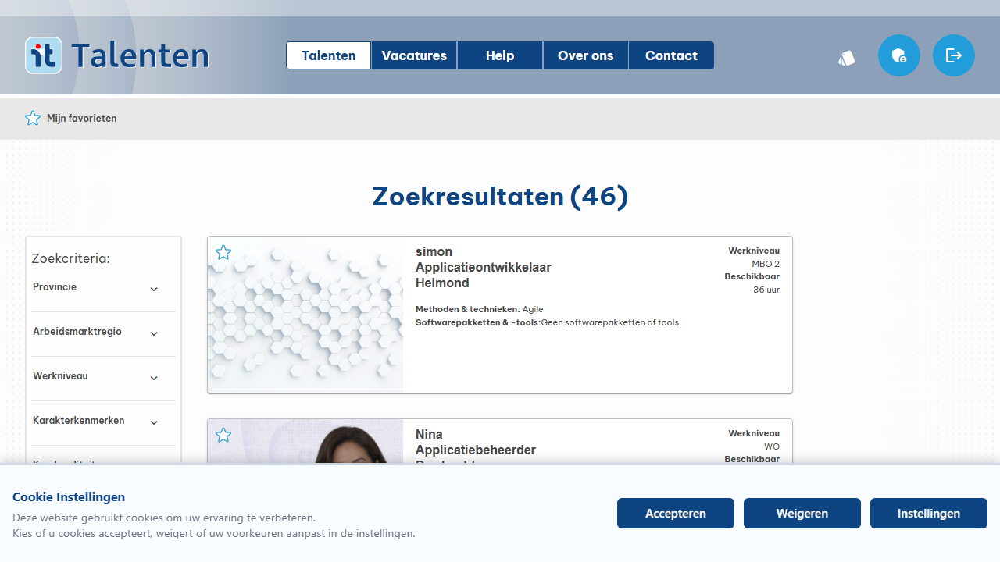

---

### TC-002 — Inloggen met onjuist wachtwoord

**Teststappen:**
1. Navigeer naar de startpagina (`/talent`) — frisse sessie (niet ingelogd)
2. Klik op het login-icoon in de navigatiebalk
3. Keycloak-loginpagina laadt
4. Vul geldige gebruikersnaam in, maar een onjuist wachtwoord
5. Klik op "Sign In"

**Verwacht resultaat:** Blijft op loginpagina; foutmelding 'Invalid username or password.' zichtbaar

**Werkelijk resultaat:**
- URL: https://bee-ids-test.azurewebsites.net/realms/bee-ideas-testing-realm/login-actions/authenticate?execution=f43f0322-1769-446a-8e4d-a96c0f233db6&client_id=angular-app-client&tab_id=64rs34enGpM&client_data=eyJydSI6Imh0dHBzOi8vaXQtdGFsZW50ZW4tcG9ydGFhbC10ZXN0LWl0LXRhbGVudGVuLXdlYmFwcC10ZXN0LmlhcG1rdy5lYXN5cGFuZWwuaG9zdC90YWxlbnQiLCJydCI6ImNvZGUiLCJybSI6ImZyYWdtZW50Iiwic3QiOiJhNWRkNWNlYS00MGQ1LTQyYmEtOGZiMy1lYzcxZTA2YmVhNjEifQ
- Foutmelding: 'Invalid username or password.'

**Conclusie:** Het systeem toont de juiste foutmelding en stuurt de gebruiker niet door. Werkt correct.

**Bewijs:**

---

### TC-003 — Inloggen met onbekend e-mailadres

**Teststappen:**
1. Navigeer naar de startpagina (`/talent`) — handmatig, Firefox
2. Klik op het login-icoon in de navigatiebalk
3. Keycloak-loginpagina laadt
4. Vul een onbekend e-mailadres in (`ditbestaaniet@test.nl`) en willekeurig wachtwoord
5. Klik op "Sign In"

**Verwacht resultaat:** Blijft op loginpagina; foutmelding 'Invalid username or password.' zichtbaar; identiek aan TC-002

**Werkelijk resultaat:**
- URL: Keycloak authenticate-endpoint (geen redirect naar portaal)
- Foutmelding: 'Invalid username or password.'

**Conclusie:** Het systeem maakt geen onderscheid tussen onbekend account en fout wachtwoord. Werkt correct.

**Bewijs:**

---

### TC-004 — Uitloggen

**Teststappen:**
1. Log in met geldige gegevens (zie TC-001)
2. Klik op het logout-icoon in de navigatiebalk

**Verwacht resultaat:** Login-icoon zichtbaar; logout-icoon verdwenen

**Werkelijk resultaat:**
- Login zichtbaar: ✔️
- Logout zichtbaar: ❌

**Conclusie:** Uitloggen werkt correct. De applicatie toont het login-icoon en verbergt het logout-icoon.

**Bewijs:**
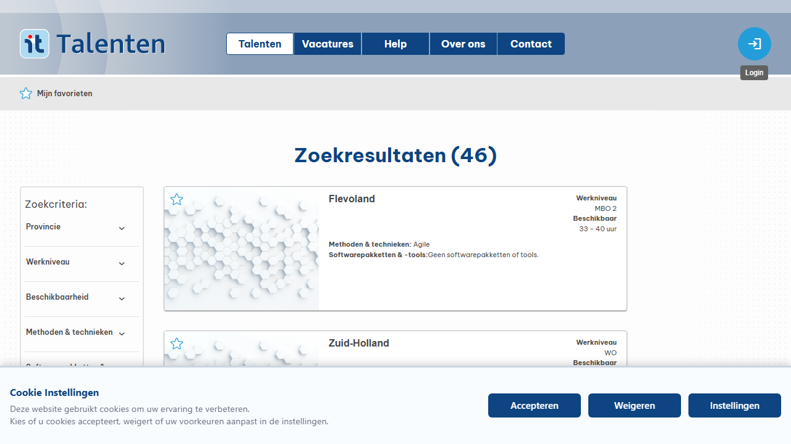

---

### TC-005 — Sessie beëindigd na uitloggen

**Teststappen:**
1. Log in met geldige gegevens (zie TC-001)
2. Navigeer naar een talentprofiel (`/talent/talentprofile/1`)
3. Klik op het logout-icoon in de navigatiebalk
4. Klik op de terugknop van de browser

**Verwacht resultaat:** Beschermde content niet meer zichtbaar na uitloggen en terugknop

**Werkelijk resultaat:**
- URL: https://it-talenten-portaal-test-it-talenten-webapp-test.iapmkw.easypanel.host/talent
- Nog op profiel: ❌
- Logout zichtbaar: ❌
- Login CTA zichtbaar: ❌

**Conclusie:** Na uitloggen stuurt de terugknop de gebruiker niet terug naar het talentprofiel maar naar de startpagina. De applicatie beëindigt de sessie correct en voorkomt actief toegang tot beschermde content.

**Bewijs:**

---

### TC-006 — Talentprofiel afgeschermd voor bezoekers

**Teststappen:**
1. Zorg dat je niet ingelogd bent
2. Navigeer direct naar een talentprofiel via de URL (bijv. `/talent/talentprofile/1`)

**Verwacht resultaat:** De getoonde informatie is niet te herleiden tot een persoon.

**Werkelijk resultaat:**
De getoonde informatie is niet te herleiden tot een persoon.

**Conclusie:** Naam en contactgegevens zijn niet zichtbaar voor niet-ingelogde gebruikers. Een inlog call-to-action is aanwezig.

**Bewijs:**
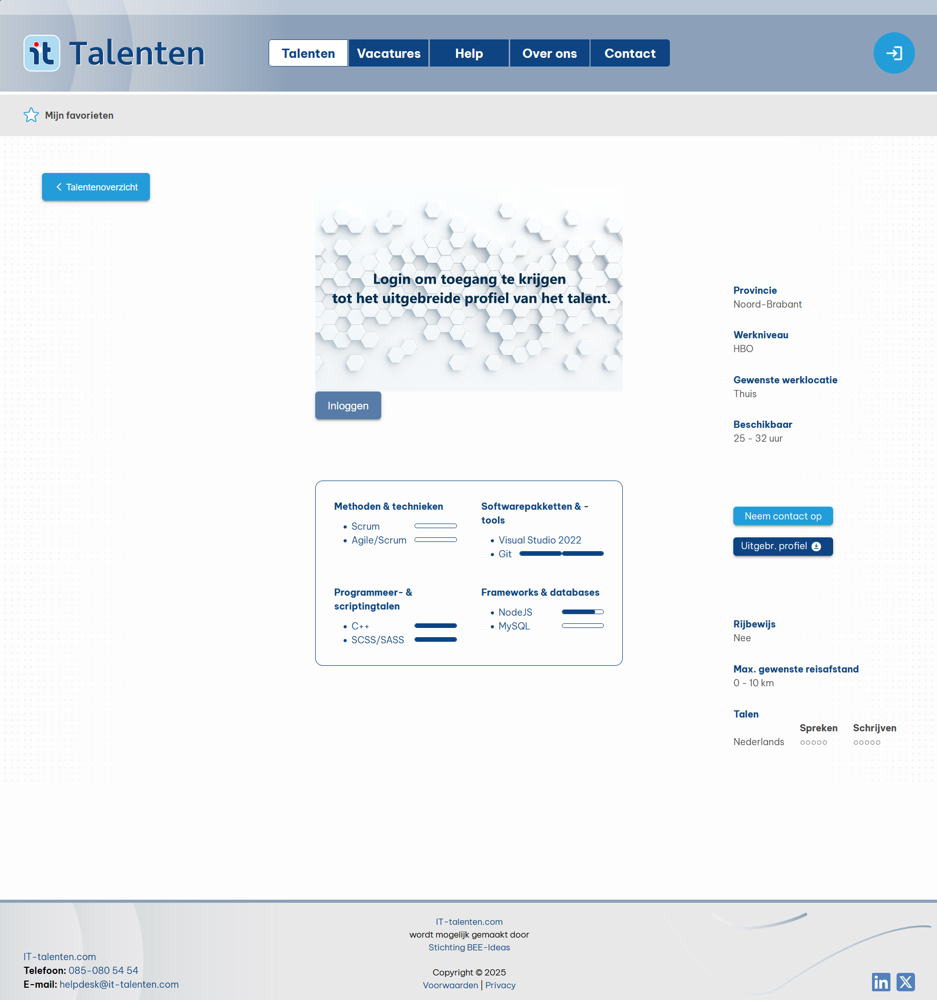

---

### TC-007 — Admin panel toegankelijkheid per rol

**Teststappen:**
1. Navigeer als bezoeker (niet ingelogd) naar `/admin`
2. Navigeer als ingelogde gebruiker (niet-admin) naar `/admin`
3. Navigeer als beheerder naar `/admin`

**Verwacht resultaat:** Bezoeker en niet-admin omgeleid; beheerder heeft toegang

**Werkelijk resultaat:**
- Bezoeker geblokkeerd: ✔️
- Niet-admin geblokkeerd: ✔️
- Beheerder heeft toegang: ✔️

**Conclusie:** Alleen de beheerder heeft toegang tot het admin panel. Bezoekers en niet-admin gebruikers worden omgeleid.

**Bewijs:**
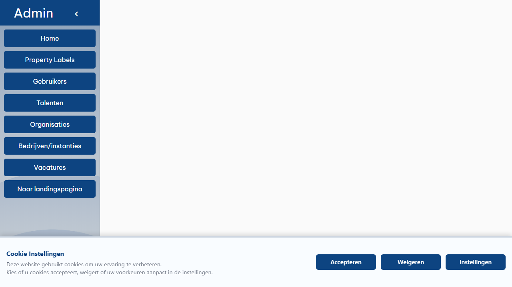

---

### TC-008 — Filteren op provincie

**Teststappen:**
1. Navigeer naar de talentenpagina (`/talent`)
2. Noteer het aantal getoonde talenten
3. Selecteer een provincie via het provinciefilter (bijv. Noord-Brabant)
4. Bekijk de gefilterde resultaten

**Verwacht resultaat:** Alleen talenten uit Gelderland getoond; aantal ≤ totaal

**Werkelijk resultaat:**
- Voor filter: 46
- Na filter (Gelderland): 2

**Conclusie:** Alleen talenten uit de geselecteerde provincie worden getoond. Het filter werkt correct.

**Bewijs:**
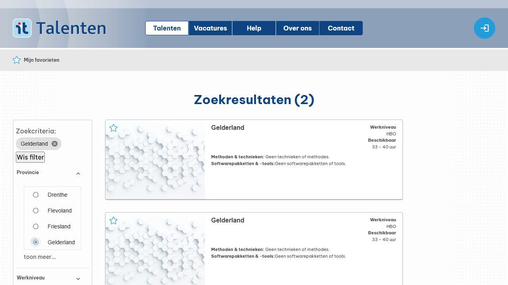

---

### TC-009 — Filteren op beschikbaarheid (grenswaarden)

**Teststappen:**
1. Navigeer naar de talentenpagina (`/talent`)
2. Noteer welke talenten beschikbaar zijn en hoeveel uur zij beschikbaar zijn
3. Stel een ondergrens en bovengrens in voor beschikbaarheid (bijv. 20–32 uur)
4. Controleer de gefilterde resultaten

**Verwacht resultaat:** Alleen talenten beschikbaar 20–32 uur getoond; aantal ≤ totaal

**Werkelijk resultaat:**
- Voor filter: 46
- Na filter (20–32 uur): 8

**Conclusie:** Alleen talenten binnen het opgegeven beschikbaarheidsbereik worden getoond. Grenswaarden worden correct verwerkt.

**Bewijs:**

---

### TC-010 — Talentprofiel volledig zichtbaar voor ingelogde gebruiker

**Teststappen:**
1. Log in met geldige gegevens (zie TC-001)
2. Navigeer naar een talentprofiel (bijv. `/talent/talentprofile/1`)

**Verwacht resultaat:** Alle profielattributen zichtbaar na inloggen

**Werkelijk resultaat:**
Volledige attributenset zichtbaar: naam, karakterkenmerken en kernkwaliteiten

**Conclusie:** Alle verwachte profielattributen zijn zichtbaar voor de ingelogde gebruiker.

**Bewijs:**
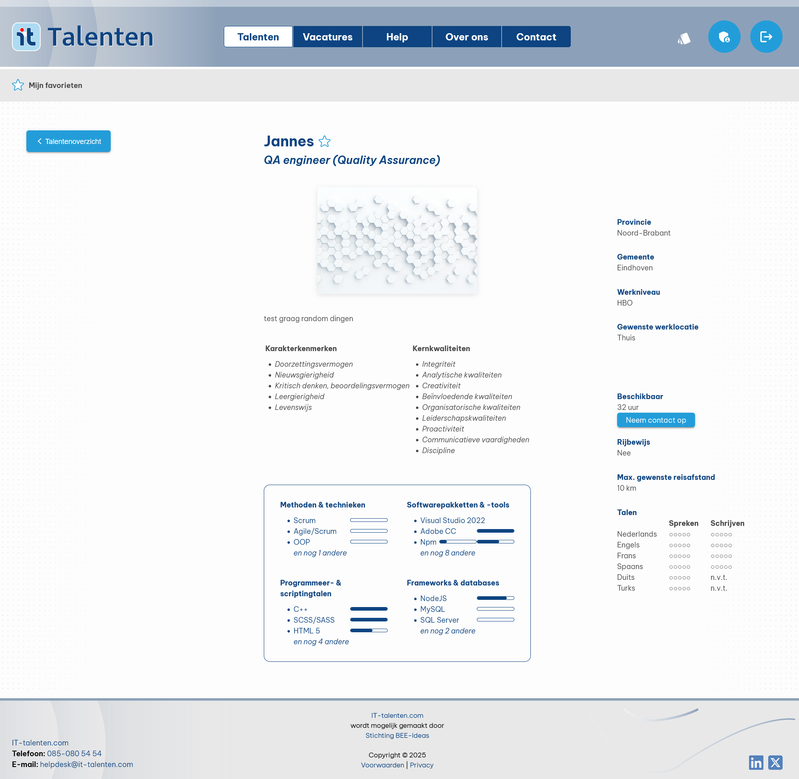

---

### TC-011 — Talentprofiel gedeeltelijk zichtbaar voor bezoeker

**Teststappen:**
1. Zorg dat je niet ingelogd bent
2. Navigeer direct naar een talentprofiel via de URL (bijv. `/talent/talentprofile/1`)

**Verwacht resultaat:** Persoonsgegevens verborgen; publieke attributen en inlog call-to-action zichtbaar

**Werkelijk resultaat:**
Geen herleidbare persoonsgegevens zichtbaar voor niet-ingelogde bezoeker

**Conclusie:** Persoonsgegevens zijn verborgen voor bezoekers. Publieke attributen en een inlog call-to-action zijn zichtbaar.

**Bewijs:**
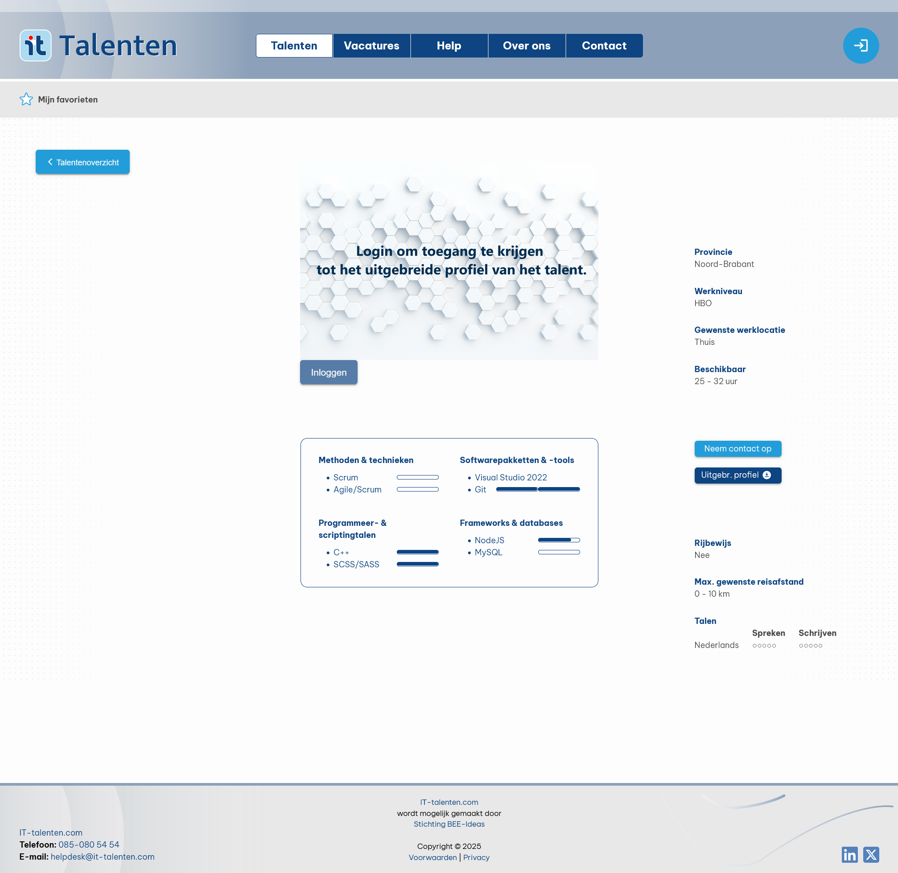

---

### TC-012 — IDOR — talentprofiel via URL-manipulatie

**Teststappen:**
1. Zorg dat je niet ingelogd bent
2. Navigeer naar `/talent/talentprofile/1`
3. Noteer welke gegevens zichtbaar zijn
4. Verander het ID in de URL naar `/talent/talentprofile/2`, `/3`, etc.
5. Controleer per profiel welke gegevens zichtbaar zijn

**Verwacht resultaat:** Geen persoonsgegevens zichtbaar bij URL-manipulatie zonder login

**Werkelijk resultaat:**
- Gecontroleerde IDs: 1, 2, 3, 4, 5
- Blootgestelde IDs: (geen)

**Conclusie:** Voor geen enkel profiel zijn naam of contactgegevens zichtbaar zonder login. Geen IDOR-kwetsbaarheid aangetoond.

**Bewijs:**
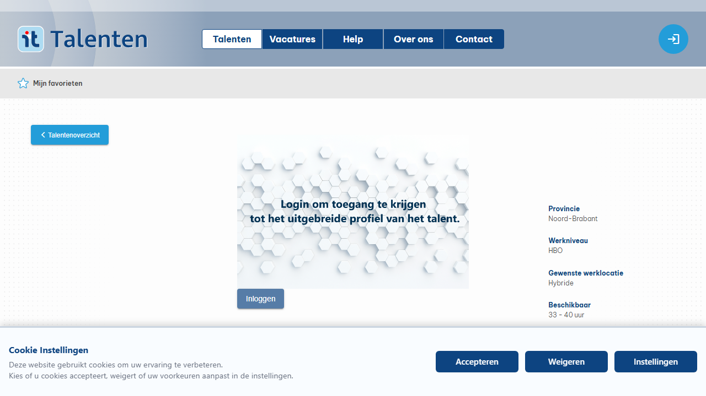

---

### TC-013 — Talent aanmaken

**Teststappen:**
1. Log in als beheerder (zie TC-001)
2. Navigeer naar `/admin/talenten`
3. Klik op "Talent toevoegen"
4. Vul de verplichte velden in met testdata (voornaam: Test, achternaam: Talent, etc.)
5. Sla het talent op

**Verwacht resultaat:** Talent verschijnt in de talentenlijst na aanmaken

**Werkelijk resultaat:**
Talent 'Test Talent' succesvol aangemaakt en zichtbaar in de lijst. Geen bevestigingsmelding getoond na opslaan.

**Conclusie:** Het talent wordt correct aangemaakt en verschijnt in de lijst. De applicatie geeft echter geen zichtbare bevestiging aan de beheerder na het opslaan.

**Bewijs:**

---

### TC-014 — Talent bewerken

**Teststappen:**
1. Log in als beheerder (zie TC-001)
2. Navigeer naar `/admin/talenten`
3. Klik op "Edit" bij het talent Test Talent
4. Wijzig de woonplaats van `Teststad` naar `Gewijzigdstad`
5. Sla de wijziging op

**Verwacht resultaat:** Woonplaats bijgewerkt naar 'Gewijzigdstad'

**Werkelijk resultaat:**
Wijziging correct opgeslagen en zichtbaar

**Conclusie:** Het bewerken van een talent werkt correct. Wijzigingen worden opgeslagen en zijn direct zichtbaar.

**Bewijs:**
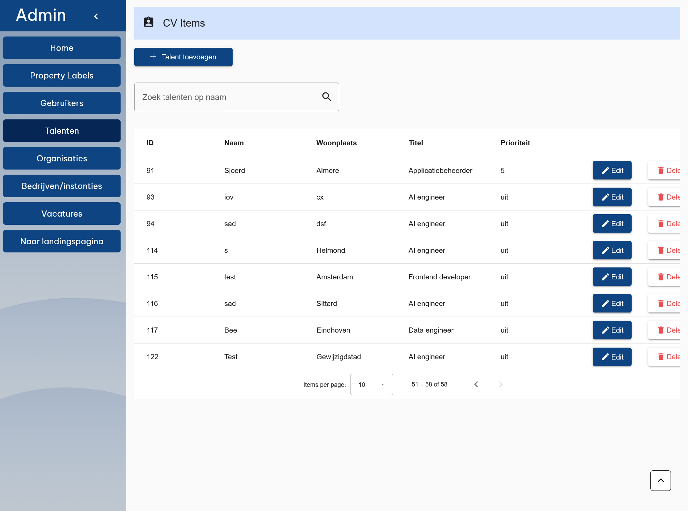

---

### TC-015 — Talent verwijderen

**Teststappen:**
1. Log in als beheerder (zie TC-001)
2. Navigeer naar `/admin/talenten`
3. Klik op "Delete" bij het talent Test Talent
4. Bevestig de verwijdering indien gevraagd

**Verwacht resultaat:** Talent verdwijnt uit de talentenlijst na verwijderen

**Werkelijk resultaat:**
Talent succesvol verwijderd. Bevestigingsdialoog aanwezig voor verwijdering.

**Conclusie:** Het verwijderen van een talent werkt correct. Een bevestigingsdialoog voorkomt per ongeluk verwijderen.

**Bewijs:**

---

### TC-016 — Werkervaring toevoegen

**Teststappen:**
1. Log in als beheerder en navigeer naar `/admin/talenten`
2. Klik op "Edit" bij een bestaand talent
3. Open het paneel "Werkervaring"
4. Voeg een nieuwe werkervaringsregel toe (werkgever: Test BV, functie: Tester, periode: 2023–2024)
5. Sla het talent op

**Verwacht resultaat:** Werkervaring 'Test BV / Tester' zichtbaar na opslaan

**Werkelijk resultaat:**
- Test BV zichtbaar: ✔️
- Tester zichtbaar: ✔️

**Conclusie:** De werkervaring is zichtbaar in het profiel van het talent.

**Bewijs:**
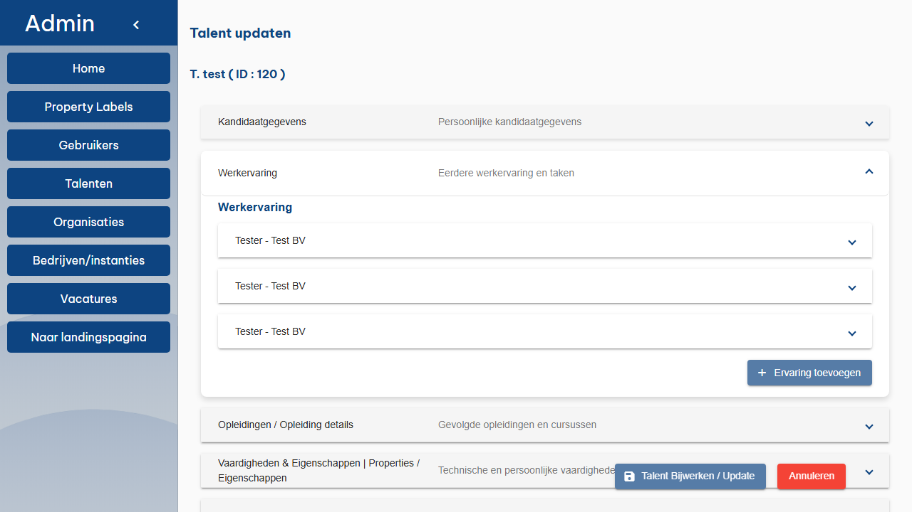

---

### TC-017 — Werkervaring bewerken

**Teststappen:**
1. Log in als beheerder en navigeer naar het bewerkscherm van een talent met werkervaring
2. Open het paneel "Werkervaring"
3. Bewerk de functietitel (bijv. van `Tester` naar `Senior Tester`)
4. Sla het talent op

**Verwacht resultaat:** Functietitel gewijzigd naar 'Senior Tester'

**Werkelijk resultaat:**
Senior Tester zichtbaar: ✔️

**Conclusie:** De gewijzigde functietitel is zichtbaar in het profiel van het talent.

**Bewijs:**
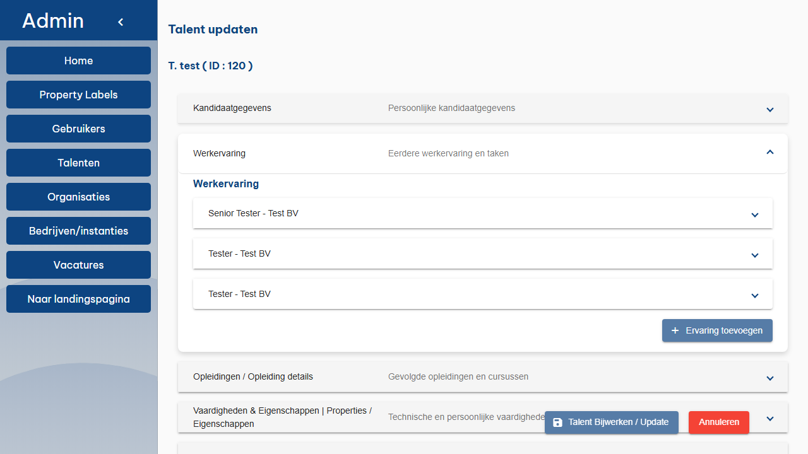

---

### TC-018 — Werkervaring verwijderen

**Teststappen:**
1. Log in als beheerder en navigeer naar het bewerkscherm van een talent met werkervaring
2. Open het paneel "Werkervaring"
3. Verwijder een werkervaringsregel
4. Sla het talent op

**Verwacht resultaat:** Werkervaring verwijderd na opslaan

**Werkelijk resultaat:**
Werkervaring succesvol verwijderd na opslaan. Bevestigingsdialoog aanwezig voor verwijdering.

**Conclusie:** Het verwijderen van werkervaring werkt correct.

**Bewijs:**
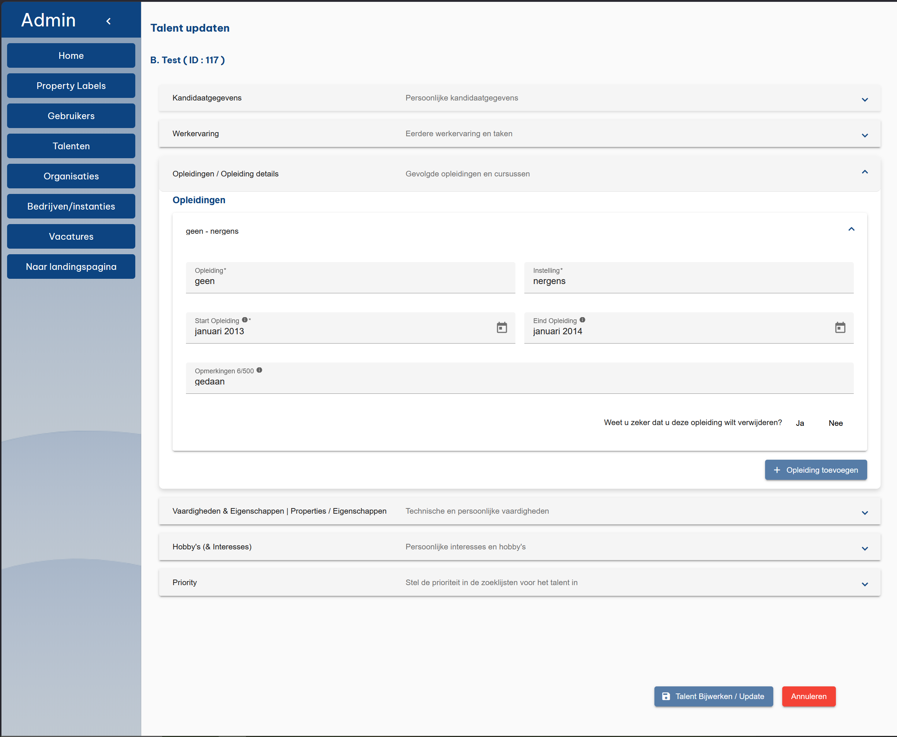

---

### TC-019 — Opleiding toevoegen

**Teststappen:**
1. Log in als beheerder en navigeer naar het bewerkscherm van een talent
2. Open het paneel "Opleidingen"
3. Voeg een opleiding toe (opleiding: Software Developer, instelling: Test ROC, jaar: 2022)
4. Sla het talent op

**Verwacht resultaat:** Opleiding 'Software Developer / Test ROC' zichtbaar na opslaan

**Werkelijk resultaat:**
Opleiding zichtbaar: ✔️

**Conclusie:** De opleiding is zichtbaar in het profiel van het talent.

**Bewijs:**
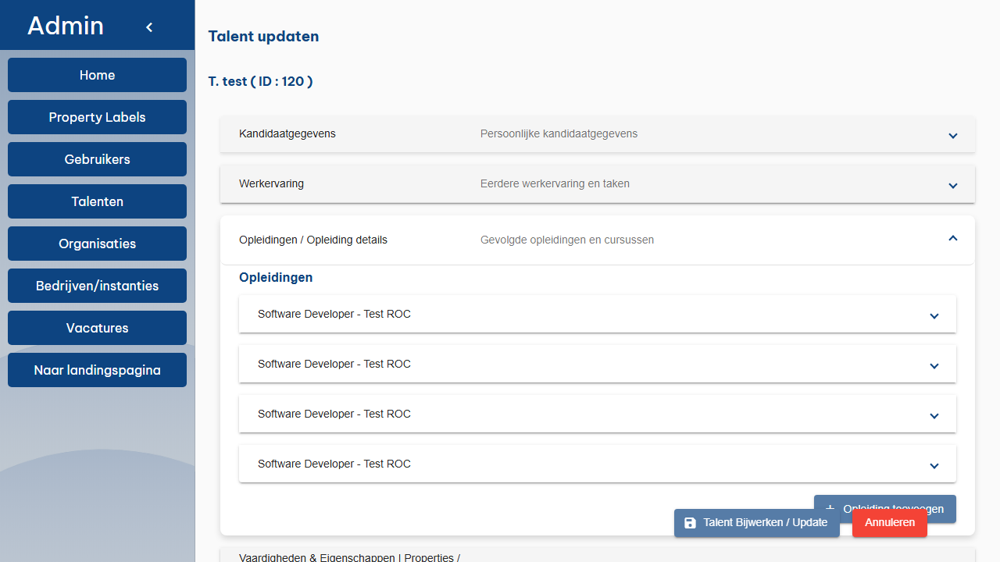
<!-- GENERATED:DETAILS:END -->

---

## 4. Gevonden fouten

### F-001: Loginpagina in het Engels

| Veld | Details |
|---|---|
| Ernst | Middel |
| Gevonden bij | TC-001, TC-002, TC-003 |
| Rol | Alle gebruikers |

**Teststappen:** Klik op het login-icoon in de navigatiebalk.

**Verwacht:** Loginpagina in het Nederlands (applicatie is gericht op Nederlandse gebruikers).

**Werkelijk:** Loginpagina toont Engelse teksten ("Sign in to your account", "Username or email", "Password", "Sign In", "New user? Register").

**SRS-eis:** Niet expliciet vastgelegd, maar strijdig met de Nederlandse context van de applicatie.

### F-002: Geen uitlogknop in het admin panel

| Veld | Details |
|---|---|
| Ernst | Laag |
| Gevonden bij | TC-007 |
| Rol | Beheerder |

**Teststappen:** Log in als beheerder en navigeer naar het admin panel (`/admin`).

**Verwacht:** Een uitlogknop of -icoon is beschikbaar vanuit het admin panel.

**Werkelijk:** Het admin panel toont geen uitlogknop. De beheerder kan niet uitloggen zonder handmatig naar de hoofdapplicatie te navigeren.

**SRS-eis:** Niet expliciet vastgelegd, maar strijdig met basale gebruikersverwachtingen rondom sessiebeheer.

### F-003: Geen bevestigingsmelding na formulieracties in het admin panel

| Veld | Details |
|---|---|
| Ernst | Laag |
| Gevonden bij | TC-013, TC-014 |
| Rol | Beheerder |

**Teststappen:** Log in als beheerder en maak een nieuw talent aan (TC-013) of bewerk een bestaand talent (TC-014).

**Verwacht:** Na het opslaan verschijnt een bevestigingsmelding (bijv. "Talent succesvol aangemaakt" of "Wijzigingen opgeslagen").

**Werkelijk:** Na het uitvoeren van de actie verdwijnt het formulier zonder zichtbare bevestiging. Het is voor de beheerder niet direct duidelijk of de actie geslaagd is.

**SRS-eis:** Niet expliciet vastgelegd, maar strijdig met basale gebruikersverwachtingen rondom feedbackmechanismen bij formulierverwerking.

### F-004: Delete-knop afgesneden bij bepaalde viewportbreedtes

| Veld | Details |
|---|---|
| Ernst | Middel |
| Gevonden bij | TC-015 |
| Rol | Beheerder |

**Teststappen:** Log in als beheerder, navigeer naar `/admin/talenten` en bekijk de pagina bij een viewport tussen ~950px en ~1560px breed.

**Verwacht:** Alle knoppen in de talentenlijst (Edit, Delete) zijn volledig zichtbaar en klikbaar bij alle gangbare viewportbreedtes.

**Werkelijk:** De delete-knop wordt visueel afgesneden bij viewportbreedtes groter dan ~950px en kleiner dan ~1560px.

**SRS-eis:** Niet expliciet vastgelegd, maar strijdig met basale bruikbaarheidseisen voor beheerschermen.

---

## 5. Statistieken

<!-- GENERATED:STATISTIEKEN:START -->
| Maat | Waarde |
|---|---|
| Totaal aantal testen | 19 |
| Geslaagd | 19 |
| Gefaald | 0 |
| Geblokkeerd | 0 |
| Slaagpercentage | 100% |
<!-- GENERATED:STATISTIEKEN:END -->

---

## 6. Conclusie

Van de 19 uitgevoerde testcases zijn alle 19 geslaagd. Er zijn geen geblokkeerde testcases. De kernfunctionaliteit van het IT Talenten Portaal — inloggen, uitloggen, profieltoegang, filteren en admin CRUD-beheer — werkt correct.

De vier gevonden fouten (F-001 t/m F-004) zijn geen functionele blokkades maar betreffen taalgebruik, ontbrekende gebruikersfeedback en een layoutprobleem. De applicatie is geschikt voor gebruik, maar de gebruikerservaring voor beheerders kan op meerdere punten worden verbeterd.

TC-020 t/m TC-024 vallen buiten de scope van dit rapport.
